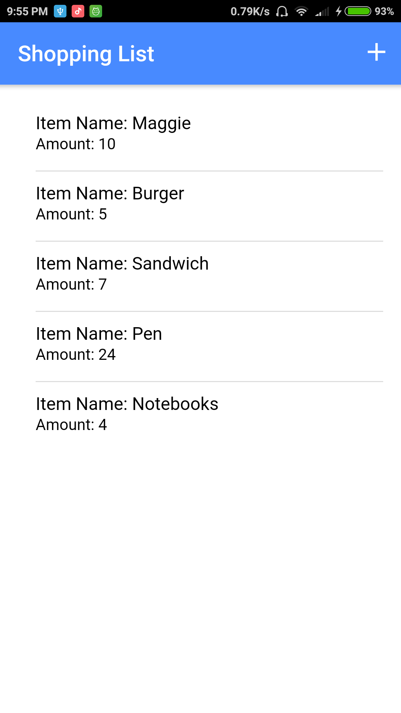
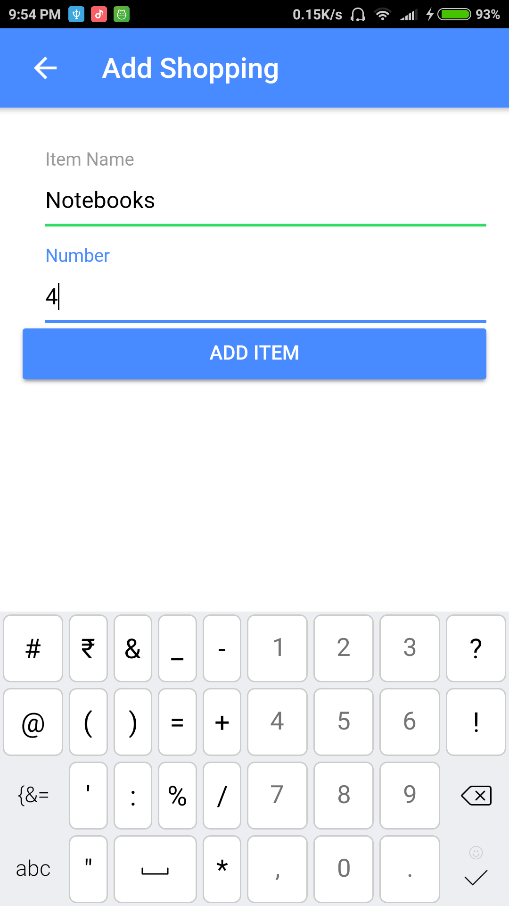
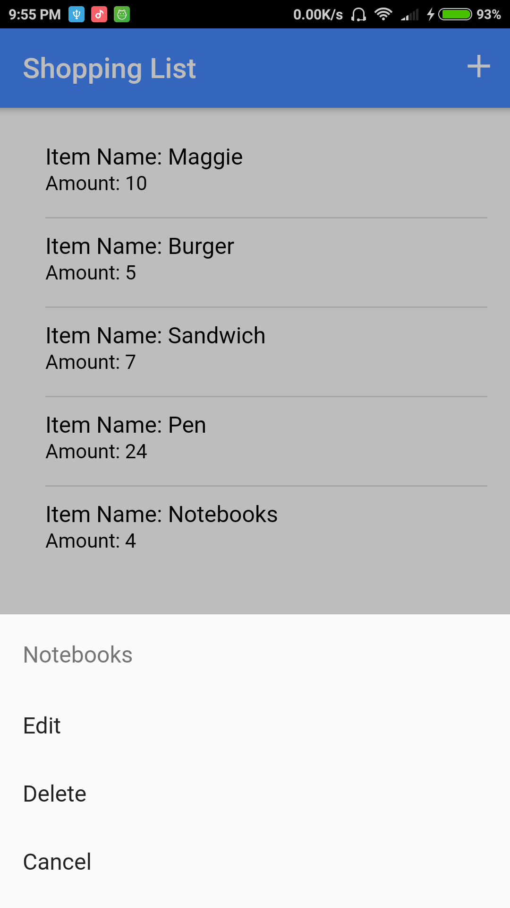
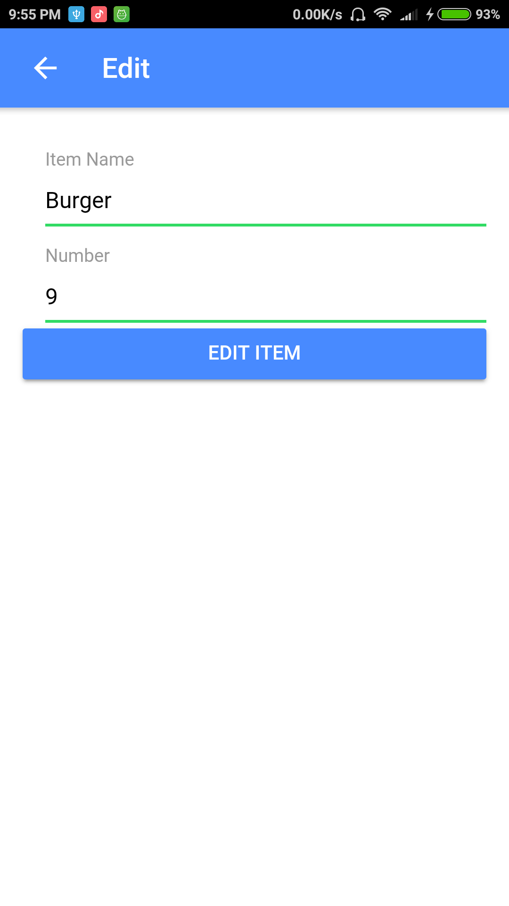

# Firebase-CRUD-Ionic-App
The given repository is an app built in **Ionic framework** that implements the basic **CRUD** functionality using **Firebase** in the form of **Shopping List**.

**App Screenshots**

   


## Project Setup

The following project requires **Node.Js** and **NPM** to be pre-installed and the necessary path variables for **Node** and **NPM** should also be set-up already.

Besides that **Android SDK** and **JAVA JDK** must also be installed before-hand and available in the **system path** for this **Ionic** app to work.

For detailed instructions on how to do that, following articles can be referred : 

[Android Platform Guide by Cordova(Official Guide)](https://cordova.apache.org/docs/en/latest/guide/platforms/android/) or

[Environment setting tutorial Ionic + Android on windows (Blog post)](http://www.tiagoporto.com/blog/environment-setting-tutorial-ionic-android-on-windows/)

Once the above required dependencies are successfully installed, open the terminal/command-line and then : 

First install **Cordova** and **Ionic**.

```
$  npm install -g cordova
$  npm install -g ionic
```
Then set-up the project:
```
$ cd \<required-directory>
$ git clone https://github.com/aakashbansal/Firebase-CRUD-Ionic-App.git
$ cd \Firebase-CRUD-Ionic-App
$ npm install
```

This sets-up the project locally on your machine.

To run the app in **Browser** :
```
$ ionic lab
```

To run the app on an **Android Device** :
```
$ ionic cordova platform add android
$ ionic cordova run android
```

To run the app on **Android Emulator** :
```
$ ionic cordova platform add android
$ ionic cordova emulate android
```

## Setting up Firebase Project

See this [Official Firebase Documentation](https://firebase.google.com/docs/web/setup) for getting familiar on how to set up **Firebase** for this app. 

After setting up the **Firebase** project on the **console**, just copy and paste the **config** object from the **Firebase console** into the **directory** -> **src/config/firebase.credentials.ts** in the format specified.

The project is good to go now.

